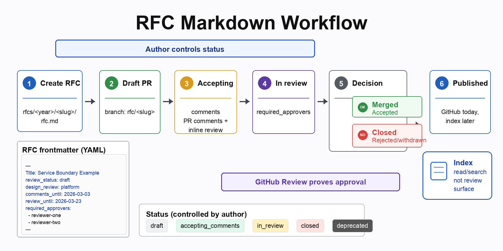

# RFC Markdown Workflow POC

This repository is a proof of concept for writing RFCs as structured Markdown
documents reviewed through GitHub pull requests.

The goal is not to replace Google Docs by default. The goal is to validate
whether engineering RFCs can become easier to write, review, approve, and index
when they follow a predictable structure.

The full decision record is available in [docs/qna.md](docs/qna.md).



## Core idea

- Authors focus on the proposal, not document design.
- Each RFC is a single Markdown file.
- Metadata lives in YAML frontmatter.
- Discussion and inline comments happen in the GitHub PR.
- Formal approval comes from GitHub Review by required approvers.
- Backstage can later consume frontmatter to render an RFC index.

## Structure

```txt
rfcs/
  README.md
  _template/
    rfc.md
    assets/
      .gitkeep
  2026/
    service-boundary-example/
      rfc.md
      assets/
```

Every RFC must live at:

```txt
rfcs/<year>/<slug>/rfc.md
```

Rules:

- `<year>` is the RFC creation year, such as `2026`.
- `<slug>` is lowercase ASCII kebab-case, derived from the title.
- Do not prefix folders with `rfc-`; the parent folder already provides context.
- One PR should create or update one RFC.
- `assets/` is optional.

## Branch and PR naming

Use an RFC-specific branch prefix so RFC work is easy to distinguish from other
repository changes:

```txt
rfc/<slug>
```

Example:

```txt
rfc/service-boundary-example
```

Use a human-readable PR title:

```txt
RFC: Service Boundary Example
```

Prefer `RFC: <Title>` over `(rfc): <title>`. The `RFC:` prefix is easier to scan
in GitHub lists and avoids mixing RFC workflow with commit-message conventions.

## Frontmatter

Minimum frontmatter:

```yaml
---
Title: Service Boundary Example
review_status: draft
design_review: platform
comments_until:
review_until:
required_approvers: []
---
```

Allowed `review_status` values:

- `draft`
- `accepting_comments`
- `in_review`
- `closed`
- `deprecated`

These map to the current Google Docs status model:

- Draft
- Accepting comments
- In review
- Closed
- Deprecated

## Lifecycle

1. Copy `rfcs/_template/rfc.md` to `rfcs/<year>/<slug>/rfc.md`.
2. Fill the frontmatter.
3. Create a branch named `rfc/<slug>`.
4. Open a Draft PR titled `RFC: <Title>`.
5. Keep `review_status: draft` while shaping the RFC.
6. Move to `accepting_comments` when broad feedback is wanted.
7. Move to `in_review` when the RFC is ready for formal approval.
8. Required approvers approve through GitHub Review.
9. Move to `closed` when the review cycle is complete.
10. Merge means accepted. Close without merge means rejected or withdrawn.

The author controls `review_status`. GitHub Review proves approval.

## Images

Pasted GitHub images are allowed. GitHub stores them as attachments and inserts
URLs such as:

```html

```

For internal or private repositories, these attachments follow repository access.
Only people with repo access can view them.

Use `assets/` when an image or diagram needs to be versioned with the repo,
reused outside GitHub, or maintained locally.

## Validation

The GitHub Action validates only RFCs changed in the current PR.

It does not:

- modify PR labels;
- edit PR descriptions;
- generate indexes;
- validate unrelated folders;
- require assets for every image.

It does validate:

- path format;
- slug format;
- frontmatter;
- status-specific required fields;
- required body sections;
- one RFC per PR;
- GitHub approvals from `required_approvers` when status is `closed`.

## Backstage

Backstage should be the read/index surface, not the review surface.

Backstage can later read frontmatter to show:

- Title;
- status;
- design review;
- comments deadline;
- review deadline;
- required approvers;
- links to the RFC and PR.

GitHub remains the source for PR comments and approvals.
